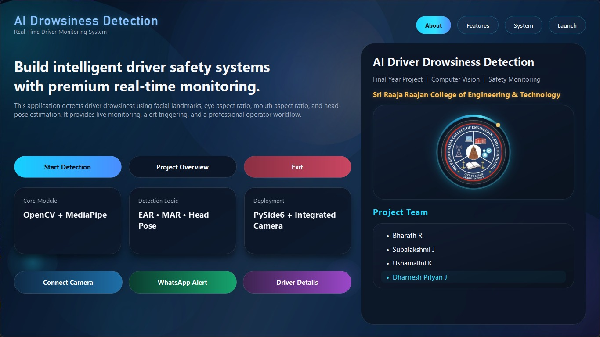
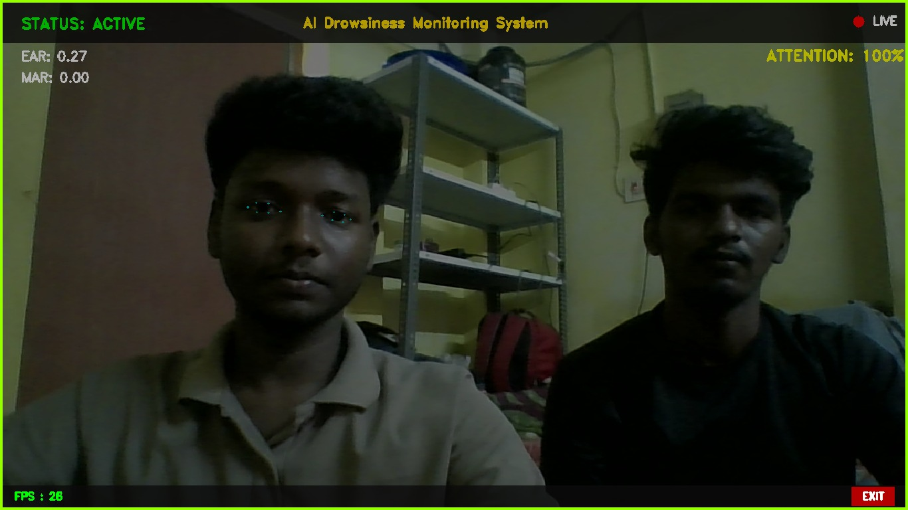

# AI-Based Driver Drowsiness Detection System 🚗😴

A real-time **AI drowsiness monitoring system** built with **OpenCV + MediaPipe Face Mesh**, designed to detect:
- Eye closure (EAR)
- Yawning (MAR)
- Head distraction (yaw angle)

Includes a professional UI overlay (top bar, FPS display, exit button) and an alarm alert system.

---

## ✨ Features
✅ Real-time face landmark tracking (MediaPipe Face Mesh)  
✅ Eye Aspect Ratio (EAR) for drowsiness detection  
✅ Mouth Aspect Ratio (MAR) for yawn detection  
✅ Head pose monitoring (yaw threshold) for distraction detection  
✅ Attention score calculation (0–100)  
✅ Alarm sound warning when drowsy/distracted/yawning  
✅ UI Overlay: Top bar, LIVE badge, FPS counter, exit button  

---

## 📸 Screenshots


### Intro Screen


### Live Monitoring


---

## 🧠 How It Works (Logic)
### Key Metrics
- **EAR (Eye Aspect Ratio):**  
  If EAR stays below a threshold for several frames → **DROWSY**

- **MAR (Mouth Aspect Ratio):**  
  If MAR exceeds a threshold → **YAWNING**

- **Head Pose (Yaw):**  
  If yaw angle exceeds threshold for several frames → **DISTRACTED**

### Status Levels
- `ACTIVE` ✅
- `DROWSY` 🔴
- `YAWNING` 🟠
- `DISTRACTED` 🟣

---

## ⚙️ Installation

### 1) Clone the repository
```bash
git clone https://github.com/dharneshpriyan/AI-Drowsiness-Detection.git
cd AI-Drowsiness-Detection
```
### 2) Install Dependencies
```bash
pip install -r requirements.txt
```
### 3) Run the Project
```bash
py main.py
```

### ⌨️ Controls
`Q → Exit`
`Click EXIT button → Exit`

### 🛠️ Tech Stack
- **Python**
- **OpenCV**
- **MediaPipe**
- **NumPy**
- **Pandas**

### 📌 Project Use-Case
This project is intended for:

- Driver monitoring systems
- Road safety research
- Academic final year project submission

### 📜 License
This project is licensed under the MIT License - see the LICENSE file for details.

### ⭐ Acknowledgements
- MediaPipe Face Mesh by Google
- OpenCV community