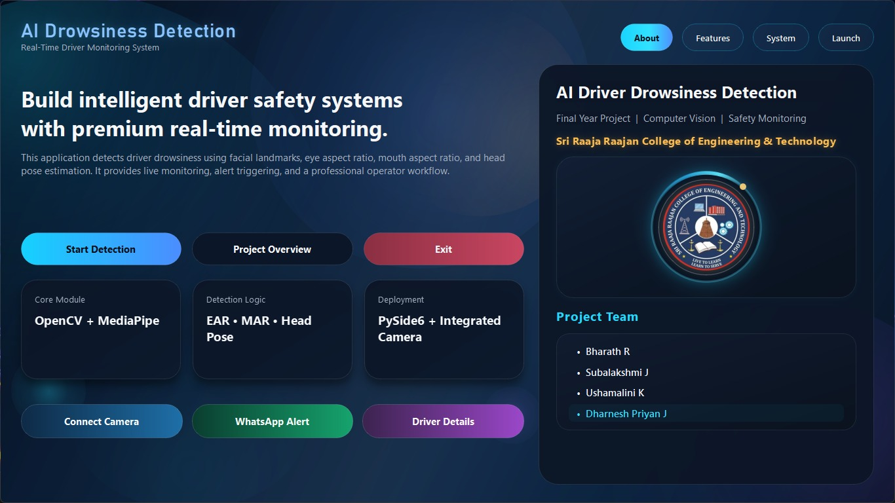
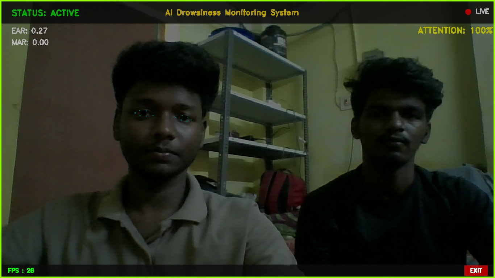

# 🚗 AI Driver Drowsiness Detection System (v2.0.0)

A **premium real-time AI driver monitoring system** built using  
**OpenCV + MediaPipe + PySide6**, designed for intelligent fatigue detection and modern desktop application experience.

An individual project developed by **Dharnesh Priyan J**.

- Email: [dharneshpriyan.j@gmail.com](mailto:dharneshpriyan.j@gmail.com)
- Portfolio: [dharnesh-portfolio.vercel.app](https://dharnesh-portfolio.vercel.app)
- LinkedIn: [linkedin.com/in/dharnesh-priyan](https://www.linkedin.com/in/dharnesh-priyan)
- GitHub: [github.com/dharneshpriyan](https://github.com/dharneshpriyan)
- Project Web Platform: [dharnesh-web.onrender.com](https://dharnesh-web.onrender.com) — includes an admin dashboard.

---

## ✨ Overview

This system detects driver drowsiness using:

- 👁 Eye closure (EAR)
- 😮 Yawning (MAR)
- 🧭 Head pose (Yaw angle)

Now upgraded with a **modern professional dashboard UI**, real-time alerts, and smart monitoring workflow.

## 🌐 Web Platform

This project is also available as a web platform at [dharnesh-web.onrender.com](https://dharnesh-web.onrender.com). It supports the same drowsiness-monitoring workflow as the desktop application and additionally provides an **Admin Dashboard** for web-based administration.

---

## 🔥 What's New in v2.0.0

✨ Premium PySide6 Dashboard UI  
✨ Animated gradient background  
✨ Integrated camera (PC + Mobile IP Camera support)  
✨ WhatsApp alert system (owner notification)  
✨ Driver details storage system  
✨ QR-based mobile camera connection  
✨ Loading screen + smooth transitions  
✨ Fullscreen detection system  
✨ EXE installer support
✨ Web platform with an Admin Dashboard

---

## 🎯 Features

✅ Real-time face landmark detection (MediaPipe Face Mesh)  
✅ Eye Aspect Ratio (EAR) → Detect eye closure  
✅ Mouth Aspect Ratio (MAR) → Detect yawning  
✅ Head pose estimation → Detect distraction  
✅ Smart attention score (0–100)  
✅ Alarm alert (after delay to avoid false trigger)  
✅ Professional UI with:

- Navigation bar (About / Features / System / Launch)
- Animated buttons & glow effects
- Blur dialogs (modern UI)
- Live camera dashboard

---

## 🖥️ Screenshots

### 🧊 Premium Dashboard UI



### 🎥 Live Detection



---

## 🧠 Detection Logic

### 👁 Eye Aspect Ratio (EAR)

If EAR stays below threshold for a number of frames →  
🔴 **DROWSY**

---

### 😮 Mouth Aspect Ratio (MAR)

If MAR exceeds threshold →  
🟠 **YAWNING**

---

### 🧭 Head Pose (Yaw Angle)

If head turns beyond threshold →  
🟣 **DISTRACTED**

---

### 🧮 Attention Score

- Starts at **100**
- Decreases based on:
  - Eye closure
  - Head distraction
  - Yawning

---

## 🚨 Alert System

- 🔊 Alarm triggers after **3 seconds delay**
- Prevents false alerts
- Can be extended to:
  - WhatsApp alerts
  - Owner notifications

---

## 📡 Camera Support

### 💻 PC Webcam

- Default camera (OpenCV)

### 📱 Mobile Camera (IP Stream)

- Supports apps like:
  - DroidCam
  - IP Webcam

### 📷 QR Scanner (optional)

- Scan mobile stream URL directly

---

## 📋 Additional Modules

### 📞 WhatsApp Alert System

- Sends alert when driver ignores warnings
- Uses owner phone number

---

### 👤 Driver Details System

- Store:
  - Name
  - Age
  - Mobile Number
- Can be extended with database

---

## ⚙️ Installation

### 1️) Clone Repository

```bash
git clone https://github.com/dharneshpriyan/AI-Drowsiness-Detection.git
```
### 2) Open Dir

```bash
cd AI-Drowsiness-Detection
```

### 3) Install Dependencies

```bash
pip install -r requirements.txt
```

### 4) Run the Project

```bash
py main.py
```

### 📦 EXE Version (Recommended)

`Download ready-to-use Windows app:`

👉 Go to Releases
👉 Download latest version (v2.0.0)

### ⌨️ Controls

- 🎮 Controls

`Exit Detection --	Q`
`Exit App	-- EXIT button`

### 🛠️ Tech Stack

- **🐍 Python**
- **🎥 OpenCV**
- **🧠 MediaPipe Face Mesh**
- **🖥️ PySide6 (GUI)**
- **🔢 NumPy**
- **📊 Pandas**
- **🔊 Playsound / Winsound**

### 📌 Project Use-Case

This project is intended for:

- 🚗 Driver Monitoring Systems
- 🛣️ Road Safety Applications
- 💼 Individual portfolio project
- 🧠 Computer Vision Research

### 📌 Future Improvements

- Cloud alert system (Firebase)
- GPS + Live location tracking
- Driver history analytics dashboard
- Deep learning eye model (CNN)
- Multi-driver detection

### 📜 License

This project is licensed under the MIT License - see the LICENSE file for details.

### ⭐ Acknowledgements

- Google MediaPipe
- OpenCV Community
- PySide6 (Qt for Python)

### 👨‍💻 Developer

`Dharnesh Priyan J`
Individual Developer

Email: [dharneshpriyan.j@gmail.com](mailto:dharneshpriyan.j@gmail.com)
Portfolio: [dharnesh-portfolio.vercel.app](https://dharnesh-portfolio.vercel.app)
LinkedIn: [linkedin.com/in/dharnesh-priyan](https://www.linkedin.com/in/dharnesh-priyan)
GitHub: [github.com/dharneshpriyan](https://github.com/dharneshpriyan)

Project Web Platform: [dharnesh-web.onrender.com](https://dharnesh-web.onrender.com) — includes an Admin Dashboard.
